# Predicting 30-Day Hospital Readmission in Diabetic Patients

**Author:** Ebenezer Ampiaw Yeboah
**Dataset:** Diabetes 130-US Hospitals (1999–2008) [7], 101,766 encounters, cleaned to 69,990 unique patients

---

## 1. Problem Statement

Since 2012, CMS's Hospital Readmissions Reduction Program (HRRP) has financially
penalized hospitals for excess 30-day readmissions, currently across six tracked
conditions (heart attack, heart failure, pneumonia, COPD, elective hip/knee
replacement, and CABG) [1][2]. Diabetes is not itself one of these six tracked
conditions, but it is a common comorbidity across them and is frequently cited by
hospitals as a leading readmission diagnosis in its own right [3]. This project
analyzes factors associated with 30-day readmission among diabetic inpatients and
builds a predictive model to flag high-risk patients at the point of discharge, so
that discharge-planning resources can be targeted where they matter most.

**Target variable:** `readmitted_30` — 1 if the patient was readmitted within 30
days, 0 otherwise. ~11.4% of patients in the cleaned dataset were readmitted
within 30 days.

---

## 2. Data Preparation

- Removed columns with excessive missingness (`weight`, `payer_code`); grouped
  `medical_specialty` into top categories.
- Converted `age` bins to numeric midpoints; grouped ICD-9 diagnosis codes
  (`diag_1/2/3`) into 9 clinical categories (Circulatory, Diabetes, Respiratory,
  etc.).
- Removed encounters ending in death or hospice (discharge disposition IDs 11,
  13, 14, 19, 20, 21), since these patients cannot be readmitted.
- Kept only the first encounter per patient to avoid data leakage from repeat
  visits, reducing the dataset from 99,343 encounters to 69,990 unique patients.

---

## 3. Exploratory Findings

### 3.1 Readmission Rate Overview

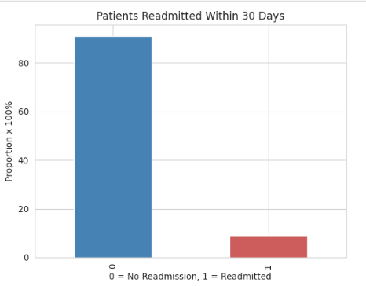

~11.4% of patients were readmitted within 30 days — a meaningful class
imbalance that shaped every modeling decision downstream.

### 3.2 Readmission Rate by Age Group

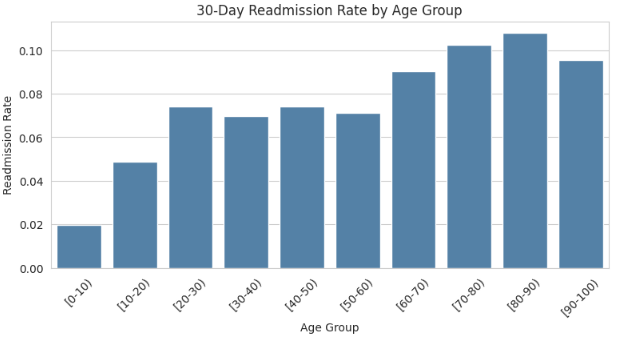

A clear, mostly-monotonic increase from ~2% in the youngest patients to a peak
of ~10.8% in the 80–90 age group, dipping slightly in the 90–100 bracket.

### 3.3 Readmission Rate by Race

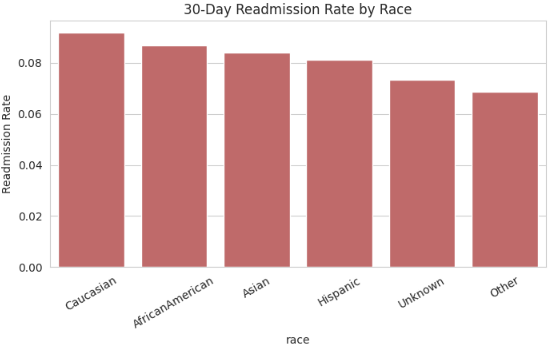

A much flatter pattern (roughly 6–10%) than age, with Caucasian and African
American patients showing the highest rates. This signal is weaker and more
susceptible to confounding than age; treat with caution.

### 3.4 A1C Testing vs. Readmission

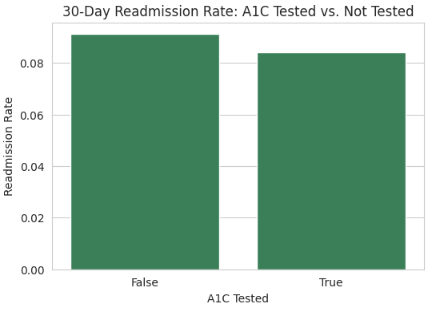

Only ~18% of patients had an A1C test recorded. Untested patients had a
slightly *higher* readmission rate (9.1%) than tested patients (8.4%) — a
modest but real association, plausibly reflecting that tested patients had
their glycemic status actively monitored before discharge.

### 3.5 Prior Healthcare Utilization

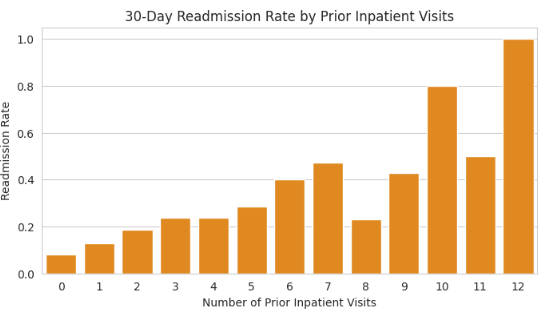

The single strongest EDA signal in the dataset: readmission rate climbs from
~8% at 0 prior inpatient visits to 40–80%+ at the high end.

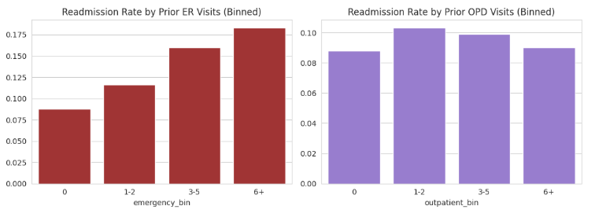

Prior ER visits also show a real (binned) upward trend, roughly doubling from
~8.5% to ~17.5% across the range. Prior outpatient visits show almost no
relationship with readmission — the weakest of the three utilization signals.

### 3.6 Diagnosis Category

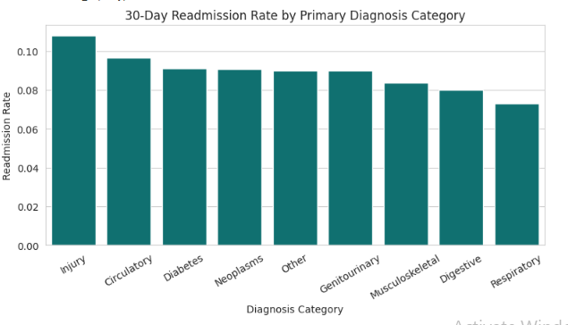

Injury (~10.5%), Circulatory, and Diabetes itself carry the highest readmission
rates among diagnosis categories with adequate sample size; Respiratory is
lowest (~7%).

### 3.7 Medication Change and Insulin Status

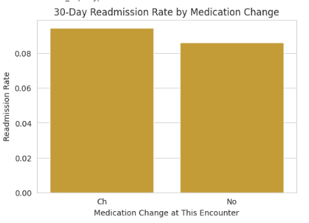
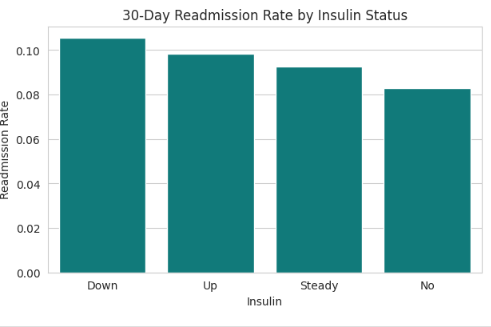

Both show modest effects. A medication change at the encounter is associated
with a slightly *higher* readmission rate than no change — likely reflecting
that sicker patients are more likely to have their medications adjusted.

### 3.8 Correlation Matrix

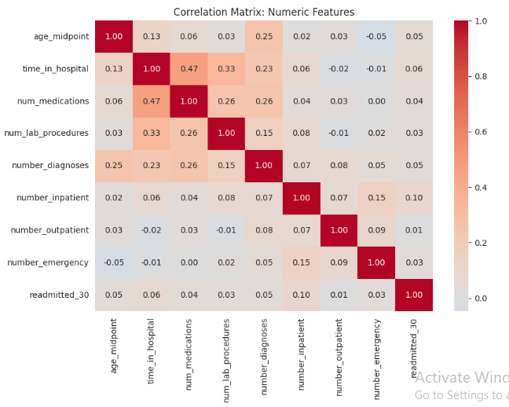

No single numeric feature is a dominant linear predictor on its own —
`number_inpatient` is the strongest at only 0.10. This motivated using a model
to combine several weaker signals rather than relying on any one feature.

### 3.9 A Note on Length of Stay

The dataset's length-of-stay distribution peaks at 3–4 days. National hospital
length-of-stay figures have shifted since this data was collected (1999–2008):
averages held roughly flat around 4.5–4.7 days from 1999 through 2019 [4], rose
to about 5.2–6.0 days by 2022 [4][5], and have trended down again more recently —
national data as of late 2025 shows length of stay running about 8% below 2022
levels, attributed to improved discharge planning and operational efficiency [6].
This dataset's shorter stays partly reflect that it covers diabetes-specific
admissions rather than the general hospital population, so a direct comparison to
all-cause national averages should be made cautiously.

---

## 4. Predictive Modeling

**Approach:** Binary classification predicting `readmitted_30`, using
demographics, admission details, utilization history, and treatment features
(one-hot encoded), with an 80/20 stratified train/test split.

### 4.1 Model Comparison

| Model | Precision (class 1) | Recall (class 1) | Notes |
|---|---|---|---|
| **Logistic Regression** (`class_weight='balanced'`) | 0.12 | **0.52** | Best overall balance |
| Random Forest (`class_weight='balanced'`) | 0.12 | 0.20 | Underperformed baseline |
| Random Forest (`balanced_subsample`) | 0.11 | 0.00 | Collapsed to majority class |
| Random Forest (threshold 0.2) | 0.14 | 0.10 | Tuned, still below baseline |
| Random Forest (threshold 0.1) | 0.11 | 0.40 | Tuned, still below baseline |
| Random Forest (threshold 0.02) | 0.09 | 0.94 | Over-corrected; precision collapsed |

**Logistic regression was selected as the primary model.** Despite testing
class weighting and threshold adjustment across a wide range, the random
forest was unable to match logistic regression's recall/precision balance on
this feature set — a useful, honest finding in its own right, showing that
added model complexity did not translate into better real-world performance
here.

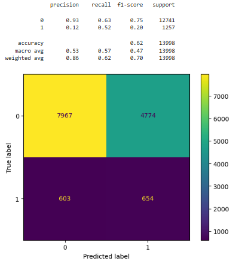

### 4.2 What Drives the Model's Predictions

**Top risk-increasing factors** (logistic regression coefficients):

| Feature | Coefficient |
|---|---|
| number_inpatient | +0.36 |
| number_emergency | +0.13 |
| time_in_hospital | +0.05 |
| diag_1_group_Missing | +0.04 |
| number_diagnoses | +0.03 |

**Top risk-decreasing factors:**

| Feature | Coefficient |
|---|---|
| diag_1_group_Respiratory | -0.34 |
| insulin_No | -0.23 |
| diag_1_group_Digestive | -0.21 |
| diag_1_group_Neoplasms | -0.16 |
| diag_1_group_Other | -0.15 |

`number_inpatient` is, by a wide margin, the single strongest predictor in the
model — consistent with the EDA finding that prior hospitalizations carry the
clearest signal in this dataset.

---

## 5. Business Recommendation

Hospitals aiming to reduce 30-day diabetic readmissions should prioritize
discharge-planning resources for patients with:

- **2 or more prior inpatient visits** in their history, and/or
- **1 or more prior emergency visits**

These two utilization factors carry the strongest, most consistent signal
found in this analysis — stronger than demographic factors, test results, or
medication changes. A simple risk-banding approach (e.g., flagging patients
meeting either threshold as "elevated risk" at discharge) would be a
low-complexity, high-signal starting point for a hospital care team, even
ahead of a full predictive model rollout.

---

## 6. Limitations

- **Correlational, not causal.** Associations found here (e.g., A1C testing,
  medication change) may partly reflect that sicker patients are more likely
  to receive certain interventions, not that the interventions themselves
  drive risk.
- **Historical data.** This dataset covers 1999–2008; care patterns, average
  length of stay, and discharge protocols have changed since.
- **Encounter-level scope.** Prior utilization counts reflect only visits
  captured within this dataset's window, not a patient's full lifetime
  history.
- **Modest model performance.** No single feature strongly predicts
  readmission in isolation (max correlation 0.10), and the final model's
  precision (12%) means most "high-risk" flags would be false alarms in
  practice — a real-world deployment would need to weigh that cost against
  the benefit of catching genuinely at-risk patients.
- **Demographic findings should be interpreted cautiously**, given they are
  not adjusted for clinical confounders in this analysis.

---

## 7. Reproducing This Project

| Notebook | Purpose |
|---|---|
| `01_data_cleaning.ipynb` | Loading, cleaning, feature engineering |
| `02_EDA.ipynb` | Exploratory analysis and visualizations |
| `03_modeling.ipynb` | Feature encoding, model training, evaluation |

Environment: Python 3.10, WSL (Ubuntu), pandas, matplotlib, seaborn,
scikit-learn.

---

## References

[1] Centers for Medicare & Medicaid Services. "Hospital Readmissions Reduction
Program (HRRP)."
https://www.cms.gov/medicare/payment/prospective-payment-systems/acute-inpatient-pps/hospital-readmissions-reduction-program-hrrp

[2] American Hospital Association. "AHA Fact Sheet: Hospital Readmissions
Reduction Program."
https://www.aha.org/factsheet/2016-01-18-aha-fact-sheet-hospital-readmissions-reduction-program

[3] Central Maine Healthcare. "Hospital Readmissions."
https://www.cmhc.org/about-us/high-quality-healthcare/hospital-readmissions/

[4] Statista / American Hospital Association. "Average length of stay in
hospitals across the United States from 1999 to 2022 (in days)."
https://www.statista.com/statistics/183916/average-length-of-stay-in-us-community-hospitals-since-1993/

[5] KFF. "Key Facts About Hospitals."
https://www.kff.org/key-facts-about-hospitals/?entry=use-of-hospital-care-inpatient-utilization

[6] Becker's Hospital Review. "Hospitals cut length of stay: 3 trends."
https://www.beckershospitalreview.com/strategy/hospitals-cut-length-of-stay-3-trends/

[7] UCI Machine Learning Repository / Strack et al. "Diabetes 130-US Hospitals
for Years 1999–2008 Data Set."
https://archive.ics.uci.edu/dataset/296/diabetes+130-us+hospitals+for+years+1999-2008
